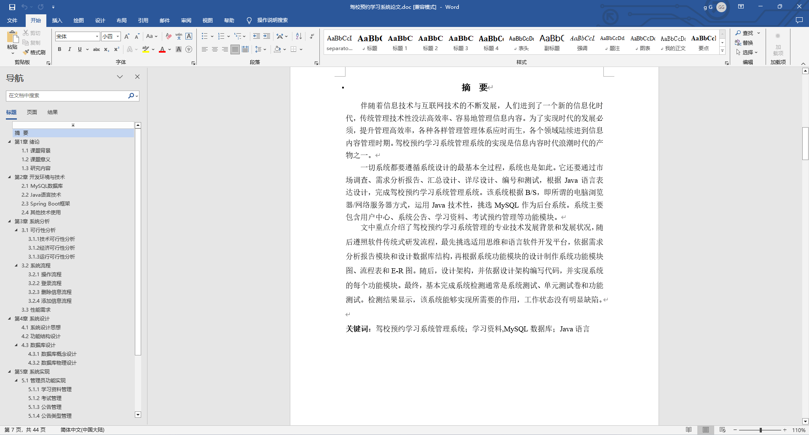
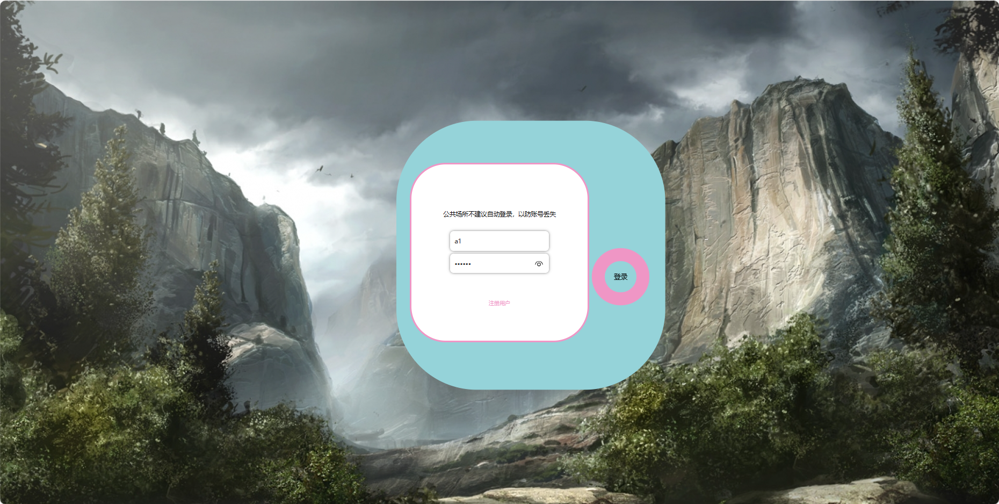
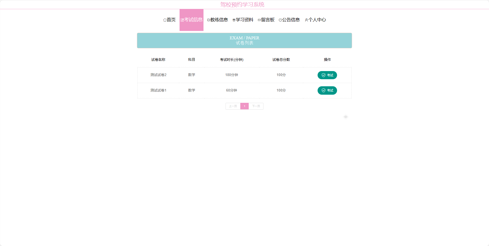
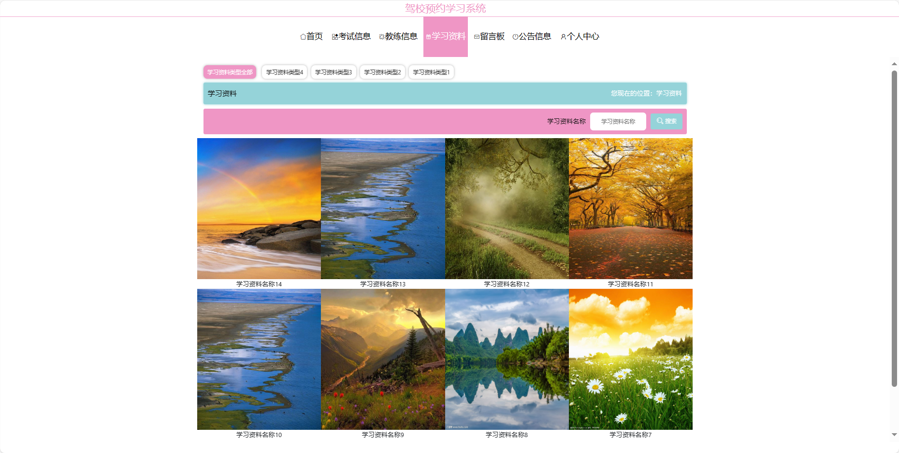
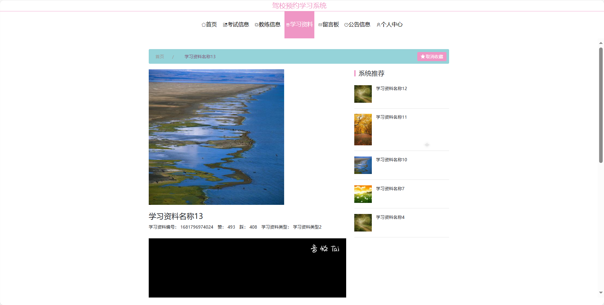
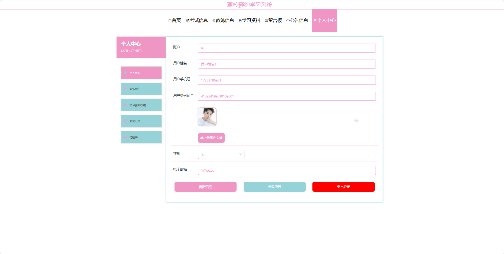
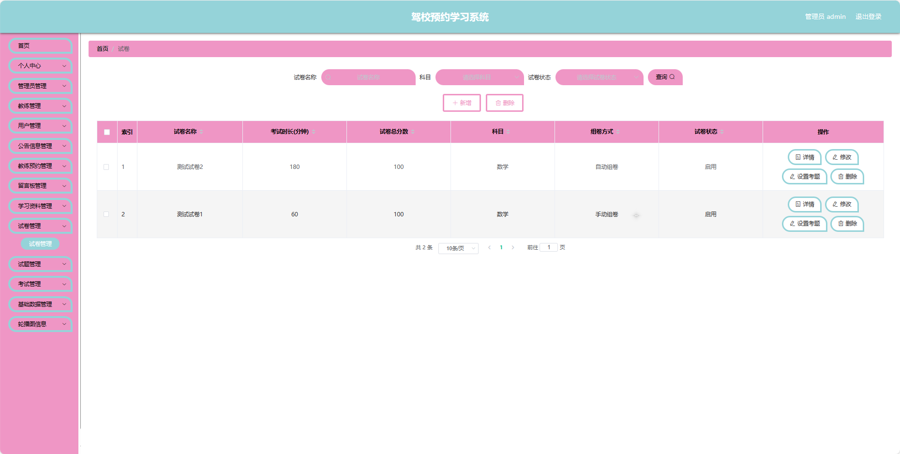
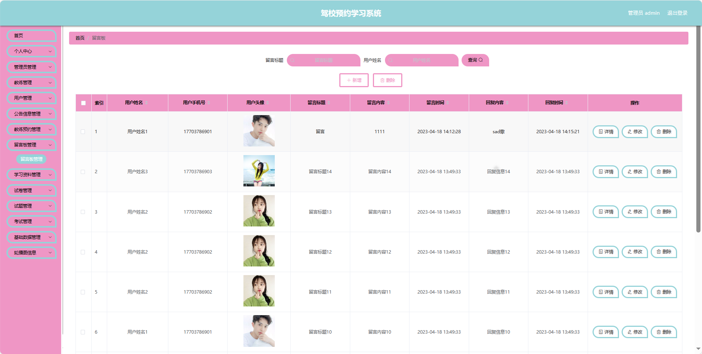
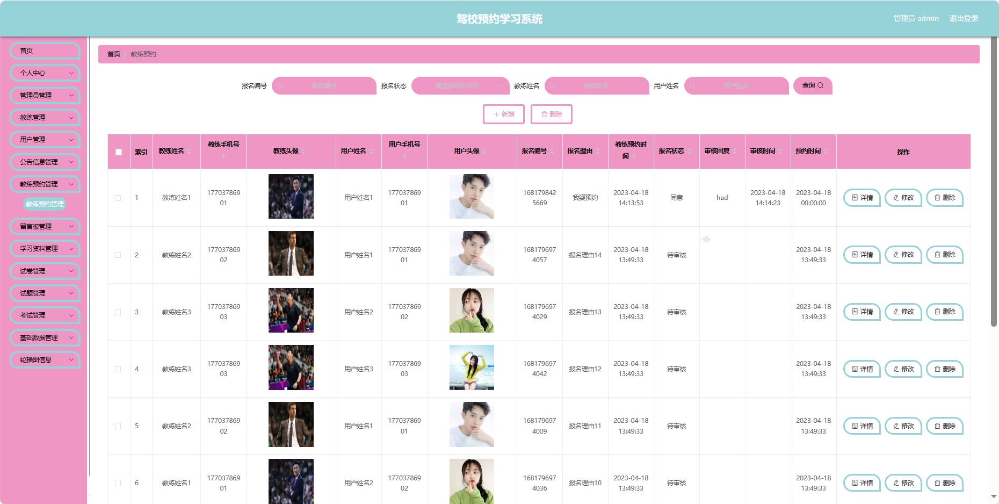

## 基于SpringBoot的驾校预约学习系统(程序+报告)

- <b>完整代码获取地址：从戎源码网 ([https://armycodes.com/](https://armycodes.com/))</b>
- <b>技术探讨、资料分享，请加QQ群：692619798</b> 
- <b>作者微信：19941326836  QQ：952045282</b> 
- <b>承接计算机毕业设计、Java毕业设计、Python毕业设计、深度学习、机器学习</b>
- <b>选题+开题报告+任务书+程序定制+安装调试+论文+答辩ppt 一条龙服务</b>
- <b>所有选题地址 ([https://github.com/YuLin-Coder/AllProjectCatalog](https://github.com/YuLin-Coder/AllProjectCatalog)) </b>

## 项目介绍
基于SpringBoot的驾校预约学习系统，系统包含三种角色：管理员、学员,教练主要功能如下。

【学员功能】
1. **首页：** 获取最新的学车信息
2. **考试信息：** 查看个人的考试信息和安排。
3. **教练信息：** 查看教练的相关信息和排班。
4. **学习资料：** 获取学车所需的学习资料。
5. **留言板：** 与其他学员和教练进行留言和交流。
6. **公告信息：** 浏览驾校发布的公告信息。
7. **个人中心：** 管理个人信息，包括修改密码、等。

【管理员功能】
1. **首页：** 查看整体系统。
2. **个人中心：** 修改密码和管理个人信息。
3. **管理员管理：** 管理系统中的管理员账号。
4. **教练管理：** 管理驾校的教练信息。
5. **用户管理：** 管理学员的账号信息。
6. **公告信息管理：** 发布和管理驾校的公告信息。
7. **教练预约管理：** 管理学员对教练的预约请求。
8. **留言板管理：** 管理留言板上的留言信息。
9. **学习资料管理：** 管理学员学习所需的资料。
10. **试卷管理：** 管理生成的试卷，包括添加和编辑。
11. **试题管理：** 管理试卷中的试题，包括添加和编辑。
12. **考试管理：** 查看学员的考试记录和错题本。
13. **基础数据管理：** 管理系统的基础数据。
14. **轮播图信息：** 管理系统首页的轮播图。

【教练功能】
1. **首页：** 查看驾校信息。
2. **个人中心：** 修改密码和管理个人信息。
3. **公告信息管理：** 发布和管理驾校的公告信息。
4. **教练预约管理：** 查看和管理学员对教练的预约请求。
5. **留言板管理：** 管理留言板上的留言信息。
6. **学习资料管理：** 管理学员学习所需的资料。
7. **试卷管理：** 管理生成的试卷。
8. **试题管理：** 管理试卷中的试题。

## 项目技术
- 编程语言：Java
- 数据库：MySQL
- 项目管理工具：Maven
- 前端技术：HTML、CSS、JavaScript、Jquery、Vue
- 后端技术：Spring、SpringMVC、MyBatis

## 运行环境
- JDK版本：JDK1.8及以上
- 开发工具：IDEA、Ecplise、Myecplise都可以
- 数据库: MySQL5.7及以上
- Maven：maven3.0及以上
- Node：14.14.0及以上

## 运行截图

